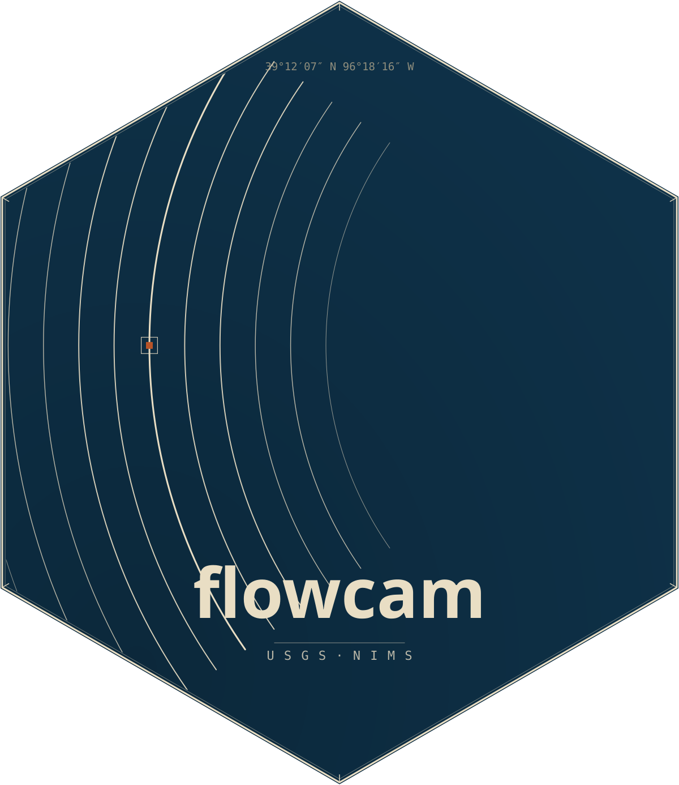
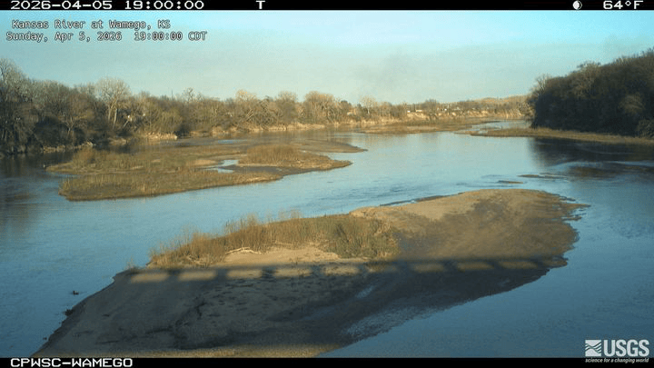

# flowcam <a href="https://connorb.github.io/flowcam/"></a>

<!-- badges: start -->
[](https://lifecycle.r-lib.org/articles/stages.html#experimental)
[](https://www.gnu.org/licenses/agpl-3.0)
[](https://github.com/ConnorB/flowcam/actions/workflows/R-CMD-check.yaml)
<!-- badges: end -->

**flowcam** provides a tidy interface to the USGS [National Imagery Management System (NIMS)](https://api.waterdata.usgs.gov/nims/v0), the API that stores and serves images collected by stream-gage cameras across the United States. Discover cameras, list and download images, and assemble them into animated GIFs or MP4 videos — all from R.



## Installation

Install from [R-universe](https://connorb.r-universe.dev/flowcam):

```r
install.packages(
  "flowcam",
  repos = c("https://connorb.r-universe.dev", "https://cloud.r-project.org")
)
```
Alternatively, install the development version from [GitHub](https://github.com/ConnorB/flowcam/):

```r
# install.packages("pak")
pak::pak("ConnorB/flowcam")
```

## Quick start

```r
library(flowcam)

# Store your free USGS API key (one-time setup)
set_usgs_api_key("your_api_key_here")

# Find the camera at the Kansas River at Wamego, KS
cam <- find_cameras(site_id = "06887500")

# List the 20 most recent images with timestamps
list_images(cam$camId, limit = 20, raw_item = TRUE)

# Download the last 30 days of images
dest <- file.path(tempdir(), "kaw")
dir.create(dest)

date_range <- c(Sys.Date() - 30, Sys.Date())

download_images(
  cam_id   = cam$camId,
  dest_dir = dest,
  size     = "small",
  time     = date_range
)

# Assemble into an animated GIF (one frame per day, 10 fps)
make_gif(dir = dest, fps = 10, one_per_day = TRUE, output = "kaw.gif")

# Or an MP4 video
make_video(dir = dest, fps = 10, one_per_day = TRUE, output = "kaw.mp4")
```

## Core functions

| Function | Description |
|---|---|
| `find_cameras()` | Retrieve camera metadata; filter by NWIS site number or camera ID |
| `find_gage_cameras()` | Like `find_cameras()`, plus NWIS site attributes (drainage area, HUC, state) via [`dataRetrieval`](https://doi-usgs.github.io/dataRetrieval/) |
| `list_images()` | List image filenames for a camera; filter by time window |
| `download_images()` | Download images to a local directory; resumes safely if interrupted |
| `make_gif()` | Assemble images into an animated GIF |
| `make_video()` | Assemble images into an MP4 video |

## Authentication

Register for a free key at <https://api.waterdata.usgs.gov/signup/>. Unauthenticated requests work but share a rate-limit pool. Store the key once and it persists across sessions:

```r
set_usgs_api_key("your_api_key_here")
```

`flowcam` uses the same `API_USGS_PAT` environment variable as [`dataRetrieval`](https://doi-usgs.github.io/dataRetrieval/), so one key covers both packages.

## Learn more

- [Getting started](https://connorb.github.io/flowcam/articles/getting-started.html) — authentication, discovering cameras, listing images, downloading, and creating GIFs and videos in one walkthrough.
- [Comparing two Pecos River gages](https://connorb.github.io/flowcam/articles/pecos-river.html) — use `find_gage_cameras()` to enrich camera records with watershed metadata, download images from two sites on the same river reach, and produce a GIF and video to track a flow event moving downstream.
- [Function reference](https://connorb.github.io/flowcam/reference/index.html) — complete documentation for all exported functions.
