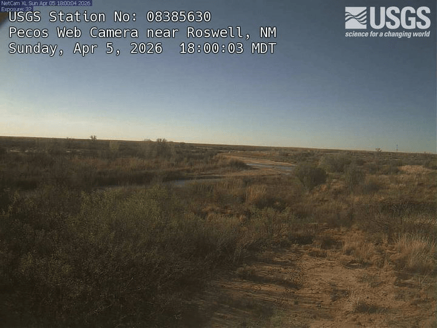

# Getting started with flowcam

**flowcam** gives you a tidy interface to the USGS [National Imagery
Management System (NIMS)](https://api.waterdata.usgs.gov/nims/v0)
API—the service that stores and serves images collected by stream-gage
cameras across the United States. With a few function calls you can
discover cameras, list available images, download them to disk, and
stitch them into an animated GIF or MP4 video.

Full function reference: <https://connorb.github.io/flowcam/reference/>

``` r

library(flowcam)
```

## Authentication

NIMS requests work without a key, but unauthenticated traffic shares a
rate-limit pool across all users. Register for a free key at
<https://api.waterdata.usgs.gov/signup/> and store it once with
[`set_usgs_api_key()`](https://connorb.github.io/flowcam/reference/set_usgs_api_key.md):

``` r

set_usgs_api_key("your_api_key_here")
```

This writes `API_USGS_PAT` to `~/.Renviron` and applies it to the
current session immediately. Every subsequent call—in this session and
in future R sessions—picks up the key automatically. The `dataRetrieval`
package reads the same environment variable, so one key covers both.

## Finding cameras

[`find_cameras()`](https://connorb.github.io/flowcam/reference/find_cameras.md)
returns a tibble of camera metadata. Called with no arguments it fetches
every camera currently registered in NIMS:

``` r

all_cameras <- find_cameras()
nrow(all_cameras)
```

Narrow to a specific USGS monitoring location by passing its NWIS site
number:

``` r

cam <- find_cameras(site_id = "08385630")
cam
```

This returns the Pecos Web Camera near Roswell, NM. The same record is
reachable by its camera identifier:

``` r

find_cameras(cam_id = "NM_Pecos_Web_Camera_near_Roswell")
```

Key columns in the result:

| Column | Description |
|----|----|
| `camId` | Camera identifier used in all other functions |
| `camName` | Human-readable name |
| `lat`, `lng` | Decimal-degree location |
| `newestImageDT` | Timestamp of the most recent image (UTC) |
| `TL_enabled` | Whether daily timelapse videos are generated |
| `smallDir`, `overlayDir`, `thumbDir` | S3 base directories for each image size |

When you only need a couple of fields—for example when scanning hundreds
of cameras—use `return_fields` to keep the response small:

``` r

find_cameras(
  site_id       = "08385630",
  return_fields = c("camName", "newestImageDT", "TL_enabled")
)
```

`camId` is always returned regardless of what you pass to
`return_fields`.

## Listing available images

[`list_images()`](https://connorb.github.io/flowcam/reference/list_images.md)
returns the filenames stored for a camera. Pass either `cam_id` or
`site_id`:

``` r

imgs <- list_images("NM_Pecos_Web_Camera_near_Roswell", limit = 10)
imgs
```

The default is a single-column tibble of filenames ordered newest-first.
Set `raw_item = TRUE` to also retrieve the capture timestamp and file
size:

``` r

list_images("NM_Pecos_Web_Camera_near_Roswell", limit = 10, raw_item = TRUE)
```

### Filtering by time

The `time` argument accepts a Date, POSIXct, or ISO 8601 character
value. A single value means “on or after”:

``` r

list_images(
  "NM_Pecos_Web_Camera_near_Roswell",
  time = "2025-06-15"
)
```

A two-element vector sets a closed window. Use `NA` for an open bound:

``` r

list_images(
  "NM_Pecos_Web_Camera_near_Roswell",
  time = c("2025-06-01", "2025-06-03")
)
```

### Chronological order

By default results are newest-first. Pass `recent = FALSE` to flip the
order—useful when you want frames in chronological order before building
an animation:

``` r

list_images("NM_Pecos_Web_Camera_near_Roswell", limit = 20, recent = FALSE)
```

### Pagination

The `limit` argument controls the API page size (1–50,000). When the
camera has more images than `limit`,
[`list_images()`](https://connorb.github.io/flowcam/reference/list_images.md)
paginates automatically using a timestamp cursor and returns all
matching records in a single tibble.

## Downloading images

[`download_images()`](https://connorb.github.io/flowcam/reference/download_images.md)
lists the images for a camera and saves them to a local directory in one
call. You must create the destination directory beforehand:

``` r

dest <- file.path(tempdir(), "roswell")
dir.create(dest, showWarnings = FALSE)

paths <- download_images(
  cam_id   = "NM_Pecos_Web_Camera_near_Roswell",
  dest_dir = dest,
  size     = "small",
  limit    = 10
)
```

`paths` is a character vector of local file paths returned invisibly.
Failed downloads are represented as `NA`.

### Image sizes

| `size`              | Approximate dimensions | Best for                        |
|---------------------|------------------------|---------------------------------|
| `"small"` (default) | ~720 px wide           | Monitoring, animation           |
| `"overlay"`         | Full resolution        | Gage-reading annotation visible |
| `"thumb"`           | ~200 px tall           | Quick visual overview           |

### Time filtering

Pass the same `time` argument as
[`list_images()`](https://connorb.github.io/flowcam/reference/list_images.md)
to restrict which images are downloaded:

``` r

paths <- download_images(
  cam_id   = "NM_Pecos_Web_Camera_near_Roswell",
  dest_dir = dest,
  size     = "small",
  time     = c("2025-06-10", "2025-06-12")
)
```

### Resuming partial downloads

[`download_images()`](https://connorb.github.io/flowcam/reference/download_images.md)
skips files that already exist in `dest_dir` when `overwrite = FALSE`
(the default). If a download is interrupted, simply re-run the same call
and only the missing files will be fetched.

## Making a GIF

[`make_gif()`](https://connorb.github.io/flowcam/reference/make_gif.md)
fetches images and encodes them into an animated GIF. It requires the
`gifski` package.

The simplest call streams images directly from NIMS—no separate download
step needed:

``` r

make_gif(
  cam_id = "NM_Pecos_Web_Camera_near_Roswell",
  time   = c("2025-06-10", "2025-06-12"),
  fps    = 2,
  output = "roswell.gif"
)
```

If you already downloaded images with
[`download_images()`](https://connorb.github.io/flowcam/reference/download_images.md),
point to that directory with `dir` to skip re-downloading:

``` r

make_gif(
  dir    = dest,
  fps    = 2,
  output = "roswell.gif"
)
```

### One frame per day

For a range spanning many days the result can be hundreds of frames.
Pass `one_per_day = TRUE` to reduce the animation to a single frame per
calendar day, selecting the image whose capture time is closest to local
noon:

``` r

make_gif(
  cam_id      = "NM_Pecos_Web_Camera_near_Roswell",
  time        = c("2025-05-01", "2025-06-30"),
  fps         = 4,
  one_per_day = TRUE,
  output      = "roswell_monthly.gif"
)
```

When `output` is not specified the file is written to `"<cam_id>.gif"`
in the working directory.

Here is a 30-day example from the Pecos Web Camera near Roswell (one
frame per day, closest to noon):



Pecos Web Camera near Roswell — April 6 to May 5, 2026

## Making a video

[`make_video()`](https://connorb.github.io/flowcam/reference/make_video.md)
produces an MP4 instead of a GIF. It requires the `av` package and
accepts the same arguments as
[`make_gif()`](https://connorb.github.io/flowcam/reference/make_gif.md):

``` r

make_video(
  cam_id = "NM_Pecos_Web_Camera_near_Roswell",
  time   = c("2025-06-10", "2025-06-12"),
  fps    = 4,
  output = "roswell.mp4"
)
```

Build from an already-downloaded directory:

``` r

make_video(
  dir    = dest,
  fps    = 4,
  output = "roswell.mp4"
)
```

MP4 files are substantially smaller than equivalent GIFs at the same
resolution and frame count, making them preferable for longer time
ranges or larger image sizes. GIFs are more portable for sharing in
contexts that don’t support video embedding.

## Next steps

- [`vignette("pecos-river")`](https://connorb.github.io/flowcam/articles/pecos-river.md)
  shows how to use
  [`find_gage_cameras()`](https://connorb.github.io/flowcam/reference/find_gage_cameras.md)
  to enrich camera records with NWIS site metadata and compare two
  cameras on the same river reach.
- The full function reference is at
  <https://connorb.github.io/flowcam/reference/>.
