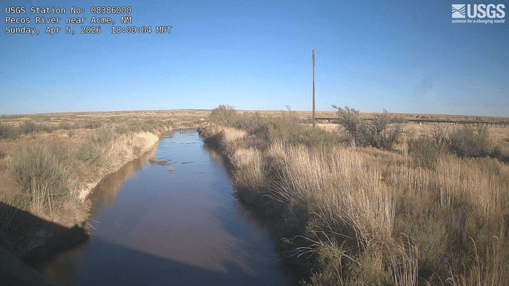

```{r setup}
#| include: false
knitr::opts_chunk$set(
  collapse = TRUE,
  comment  = "#>"
)
```

The Pecos River drains the Sacramento Mountains before flowing southeast through the Roswell Basin toward the Texas state line. Two USGS stream-gage cameras sit roughly 45 km apart along this reach:

| Site | NWIS ID | Camera ID |
|---|---|---|
| Pecos Web Camera near Roswell | 08385630 | `NM_Pecos_Web_Camera_near_Roswell` |
| Pecos River near Acme | 08386000 | `NM_Pecos_River_near_Acme` |

Because a flood pulse typically takes several hours to travel between the two sites, comparing the image records lets you watch a flow event propagate downstream. This vignette shows how to discover both cameras, list and download images, and produce an animated GIF and an MP4 from the two sites.

```{r libraries}
library(flowcam)
library(dataRetrieval)  # install.packages("dataRetrieval") if needed
```

## Camera discovery with gage metadata

`find_gage_cameras()` wraps `find_cameras()` and joins in NWIS site attributes—drainage area, state, county, hydrologic unit code—via `dataRetrieval::read_waterdata_monitoring_location()`. The result has every column returned by `find_cameras()` plus the enriched NWIS columns where available.

```{r find-gage-roswell}
roswell <- find_gage_cameras("08385630")
roswell
```

```{r find-gage-acme}
acme <- find_gage_cameras("08386000")
acme
```

Columns added by the NWIS join include:

| Column | Description |
|---|---|
| `monitoring_location_name` | Full official site name |
| `drain_area_va` | Drainage area in square miles |
| `hydrologic_unit_code` | 12-digit HUC |
| `state_name` | State of the monitoring location |

Compare drainage area between the two sites—Acme is downstream so its contributing watershed is larger:

```{r compare-metadata}
data.frame(
  site      = c("Roswell", "Acme"),
  site_id   = c("08385630", "08386000"),
  drain_mi2 = c(roswell$drain_area_va, acme$drain_area_va),
  lat       = c(roswell$lat, acme$lat),
  lng       = c(roswell$lng, acme$lng)
)
```

Check image availability before downloading. `newestImageDT` (UTC) tells you when each camera last reported:

```{r check-availability}
roswell$newestImageDT
acme$newestImageDT
```

## Listing images from both cameras

Use the same `time` window for both sites so the image sets are directly comparable. A two-element vector passed to `time` sets a closed interval; a single value means "on or after":

```{r list-both}
window <- c("2025-06-10", "2025-06-13")

roswell_imgs <- list_images(
  "NM_Pecos_Web_Camera_near_Roswell",
  time     = window,
  raw_item = TRUE,
  recent   = FALSE        # chronological order
)

acme_imgs <- list_images(
  "NM_Pecos_River_near_Acme",
  time     = window,
  raw_item = TRUE,
  recent   = FALSE
)
```

Bind the two results to compare counts and timestamps side by side:

```{r compare-images}
rbind(
  cbind(site = "Roswell (08385630)", roswell_imgs),
  cbind(site = "Acme (08386000)",    acme_imgs)
)
```

`raw_item = TRUE` returns `camId`, `filename`, `timestamp`, and `fs` (file size in kilobytes). The timestamps are UTC strings in NIMS format (`YYYY-MM-DDTHH-MM-SSZ`).

## Downloading images from both sites

Create a separate destination directory for each site so the files don't mix:

```{r dirs}
roswell_dir <- file.path(tempdir(), "roswell")
acme_dir    <- file.path(tempdir(), "acme")
dir.create(roswell_dir, showWarnings = FALSE)
dir.create(acme_dir,    showWarnings = FALSE)
```

Download the Roswell images first:

```{r download-roswell}
roswell_paths <- download_images(
  cam_id   = "NM_Pecos_Web_Camera_near_Roswell",
  dest_dir = roswell_dir,
  size     = "small",
  time     = window
)
```

Then the Acme images:

```{r download-acme}
acme_paths <- download_images(
  cam_id   = "NM_Pecos_River_near_Acme",
  dest_dir = acme_dir,
  size     = "small",
  time     = window
)
```

Both calls skip files that already exist on disk (`overwrite = FALSE` by default), so re-running after an interrupted download is safe. Switch to `size = "overlay"` if you want the full-resolution images with the gage-height annotation overlaid.

## GIF of the Roswell camera

Build an animated GIF from the images already on disk by pointing `dir` at the download directory. This avoids a second round of network requests:

```{r gif-roswell}
make_gif(
  dir    = roswell_dir,
  fps    = 3,
  output = "roswell_event.gif"
)
```

For a time range spanning multiple days, `one_per_day = TRUE` reduces the animation to one frame per calendar day—the image captured closest to local noon in the camera's time zone. This keeps the GIF from becoming unwieldy over a long monitoring period:

```{r gif-one-per-day}
make_gif(
  cam_id      = "NM_Pecos_Web_Camera_near_Roswell",
  time        = c("2025-05-01", "2025-06-30"),
  fps         = 4,
  one_per_day = TRUE,
  output      = "roswell_seasonal.gif"
)
```

Adjust `fps` to control playback speed: 1–2 fps gives enough time to read individual frames during a flood event; 4+ fps is better for a seasonal overview where you want to convey change over weeks.

`make_gif()` requires the `gifski` package (and `jpeg`/`png` for JPEG-format source images, which NIMS typically serves).

Here is a 30-day example from the Roswell camera (one frame per day):


## Video of the Acme camera

`make_video()` produces an MP4 from the same inputs. It accepts identical arguments to `make_gif()` and requires the `av` package:

```{r video-acme}
make_video(
  dir    = acme_dir,
  fps    = 3,
  output = "acme_event.mp4"
)
```

You can also stream directly from NIMS without a prior download:

```{r video-direct}
make_video(
  cam_id = "NM_Pecos_River_near_Acme",
  time   = window,
  fps    = 3,
  output = "acme_event.mp4"
)
```

An MP4 at the same resolution and frame count is substantially smaller than a GIF. For a multi-day event with hundreds of frames, video is generally the better choice; GIF is more convenient for embedding in tools that don't support video.

Here is the same 30-day window from the Acme camera for comparison:



## Tips

- **Check `newestImageDT` first.** If the timestamp is hours or days old the camera may be offline. Spot-check before committing to a large download.
- **Use `"thumb"` for exploration.** Thumbnails are around 200 px tall and much smaller than `"small"` images. Download a thumb set first to verify coverage before switching to `"small"` or `"overlay"`.
- **Time zones.** All NIMS timestamps are UTC. The `tz` column in the camera metadata records the camera's local IANA time zone if you need to convert for display or `one_per_day` interpretation.
- **Large downloads.** `"small"` images are roughly 150–300 KB each. A 30-day window at one image per 15 minutes is around 2,900 files (~600 MB). Plan accordingly and use `overwrite = FALSE` to resume safely.
- **Rate limits.** Unauthenticated requests share a pool across all users. Store an API key with `set_usgs_api_key()` (see `vignette("getting-started")`) to use your personal allocation.

Full function reference: <https://connorb.github.io/flowcam/reference/>
